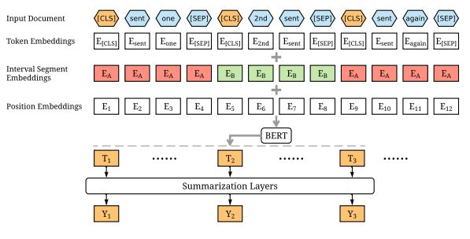

# Extractive Text Summarization
- The extractive text summarization technique involves pulling keyphrases from the source document and combining them to make a summary. The extraction is made according to the defined metric without making any changes to the texts.

- BERT(Bidirectional Encoder Representations from Transformers) is basically
a trained Transformer Encoder stack.

Two model of BERT:
1. BERT BASE - Comparable in size to the OpenAI Transformer in order to
compare performance.
2. BERT LARGE - A ridiculously huge model which achieved the state of the
art results reported in the BERT paper.

   
* BERT Model for summarization

#### Our extractive model is built on top of the BERT encoder by stacking different models on top of it.
* BERT+ simple classifier
* BERT+ Transformer.
* BERT + RNN

#### Team Members: Aman Krishna (2018201070) Ishan Tyagi (2018201017) Rajat Yadav (2018201077) 
